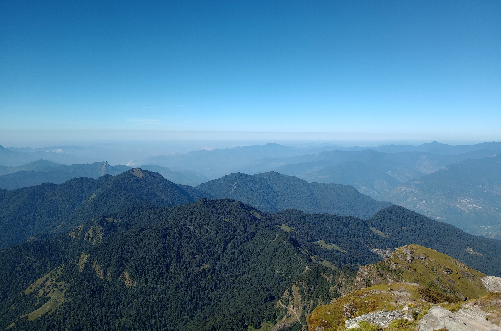

# I went to the Moon Rock

I celebrated my birthday recently by planning a trip to Tungnath with my parents. Mode of travel was mainly train and bus, soon things changed. We realized the bus schedules weren't updated, so we had to travel to Rishikesh from Haridwar. 

Destination: Chopta.

Distance: 161 km. 

Google Maps will say 4-5 hours. Don't trust it. Took us a whole day. Good thing we had time to throw at. I mean yeah this is what I want to do, travel in bus, trying not to throw up by starving myself and drinking fluids all day. So, roadways buses were crowded, bit too much actually so we had to do a little detour, just travel till Rudraprayag in one bus, then switch to another for Ukhimath.

We had plans to stay in Ukhimath because we were tired after a whole hellish day of bus travel, but then I said fuck it and chose to go for Chopta anyways because there's nothing I was going to do in Ukhimath other than just walking around and watching youtube.

So, we hired a taxi, found enough people, and got started with the journey. I was dizzy already, I knew my sugar levels were high as Snoop because it was my 4th drink of the day and I was avoiding caffeine. Yeah my caffeine addict brain couldn't take it, I slept during travels. I mean, I worked hard for 3 months straight, I needed this break. I'm not taking the blame for sleeping through travels. If I stayed awake, I would've definitely thrown up. But idk what that would've been as I was doing "haha checkmate gut, there isn't anything to throw up muahahahahahaha" thing.

Anyhoo, the car started going uphill. My ears were popping and then it got cold. Real cold. The temperatures fucking dropped down to 10 C or something from 20 C. On top of that some dude insisted on keeping window open or he'll throw up. He didn't throw up the whole trip. Anyways, I'd rather prefer a little chilly air for 40ish KM straight than smelling the stink. I was wearing a T-Shirt, my hands were numb from cold air blasting through the window and I was asleep again, drooling on my backpack. 

We reached Chopta, it was cold. I quickly pulled out a sweater from my backpack. Hotels knew it was evening, there was no way they are going anywhere. Rooms for 2 were all booked out, we ended up getting a room for 5. It was pricier than the ones for 3, but I'd say be got a bargain. Dude gave us too much stuff for free, for a place where there is no electricity supply and almost everything runs on solar, getting as much hot water we want to drink in cold, I'd call that a good deal. Anyhoo, price was alright, rooms were grand. I paid the rent, felt like a real gigachad not gonna lie.

It was dark (no lights at all, because solar), we went for a walk. I had never seen stars so clear before. My phone was picking up enough signals to make calls, I had everyone I needed in my life right now anyways, I was thankful that I was there with them. Probably it was the first trip of my life where my parents weren't fighting like they were on the verge of getting separated forever. I started humming to Tears in Rain, the Vangelis Music.

We started our trek for Tungnath at 4 A.M. Tungnath is part of panch kedar, the 5 kedar temples, the oldest temples dedicated to the Lord Shiva. I've heard about all the garbage VIP systems in Kedarnath and whole temple is basically "you get to see the big man if you pay up". Though people were saying tourists don't usually go a lot to Tungnath, so it is pretty nice. I wanted it to be nice. I wanted my trip to be nice, that's why I chose trip to Tungnath over Badrinath. 

We were walking in middle of the night, there was no one, other than a group who were pretty far ahead of us, but still we could hear their footsteps. It was so calm that probably I could've woken the whole Chopta up with a scream. We were taking breaks, eating snacks that I had my mom to prepare, considering what terrain we would be climbing, as it was night no shops were open either, so we already had brought good amount of water with us, as I insisted on that. Don't worry, I was the one carrying the luggage, I might not look like much (I am, not much, I'm just lightweight who's used to his backpack and shoes) but it wasn't hard for me to climb, probably because of all the excitement. You see, I've never been to the oceans, I have never been to the cold mountians. It was my first time seeing those mountains. I mean, I could see snow clad mountains after just 20 mins of trek. Excited? You bet I was!

Dammit! Should've started earlier, missed the sunrise! Anyways, here's "The Moonset".

I must say, my camera is absolute garbage, but it somehow makes it look vintage, like it was taken on a Polaroid or something.

Finally arrived at Tungnath, around 6-ish. Tungnath wasn't open yet, saw a board which said Chandrashila, the moon rock, is 1 Km ahead. I must tell you, it was a lie. Well, you see, Chandrashila sits at 3,690 m of elevation. Tungnath is at 3,680 m of elevation. Now, it might not sound like much, but climbing a steep mountain where path just disappears wearing sneakers isn't exactly easy for a sleep deprived person like me. I still managed to climb the whole thing. Dude, it was like minecraft, but in real life. The biomes I got to see, the algaes, they were so cool. (It was finally the dusk and we could see stuff around). For a person like me who spent most of his life in the city, this was too much for me to process. There were flowers that I had never seen, birds that I had never seen, apparently there were lots of ravens, and weird dogs chasing them around like they got no fear of falling off the mountain. Who am I kidding, that ain't a dog, that's a DAWG. 

Took like 40 mins for us to get here, just to climb that 1 Km. Finally.

Oh sweet mountains look at dem folds awwwwwwww

I think this makes a cool picture, snowy mountains and stuff, looks absolutely based. True sigma grindset. Let the sunshine, I'm going to stay on my grind, being snowy.

Don't worry, the place wasn't absolutely desolated with rocks and dogs and snow with some humans who were apparently smoking? But yeah, there were some greens to munch on and blues to vibe to. The sun was going up, and I was getting hungry. We started going down. I realised it was actually 1 Km. Or maybe I was just following the lead of the pull. 

I refuse to believe I was on a trip. I must have been kidnapped and sent to the a movie world. 

Probably this was the moment where a part of me said, HA GOTEM! Told you what you wanted was too good to be true, there will be crowd no matter where you go. Touch some grass dude, you should go out more. This had less crowd than the temple that's almost next to my house. 

I waited for the queue. Huh, no one's cutting their lines, no one's fighting to go inside first? The priests are telling their families to get together as they are here to do rituals / take blessings of Lord Shiva, a moment that you should keep in your heart? Also he was telling people to not to gossip? Whoa, I was sure this was a dream. No nonsense of scamming money off of people, priest was actually giving people good life lessons? Absolutely gigachad and based. Also, absolutely based Lord Shiva's temple. No fancy decorations, built from stones, chants of mantras and the mountains, perfection! I will go there a thousand times and be happy. I've never been satisfied with temples, last one I liked was a year ago when we went to visit Mata Vaishno Devi. (Nope, I've been to Vridavan and Mathura, don't like any of them a bit.)

Though this was part of the panch kedar temples, I never felt that grand vibe from it. It almost felt like it was a part of the nature, like it's been there since the dawn of the time, the first bang in the void. 

I don't know if I was hallucinating from hunger but this sure looks likes a prehistoric animal who decided to just pop up to me. It still does.

I never realised how high I was. I wasn't able to figure that out in dark. Everything was so silent back then, it felt so close.

So, we came to Chopta, got our bags from Hotel. We were supposed to go back to Ukhimath, but then my Mom said, we do have a day to kill and Badrinath isn't that far. Going back isn't worth it either. We will probably get bus back to Haridwar from there easily. I was out of energy, but after eating lunch I said hell yeah and we went hopping around town to town on a taxi again.

Yeah, it was far. Again. After starting at 2 P.M. we were supposed to get there by 7-ish, but then traffic jams happened because some dude didn't know how to drive. Not our taxi guy tho. He was helpful. Helped us to get there, even helped us to get a good hotel for cheap. And yeah, as it was too late, we ended up staying at Joshimath, which was one of the best decisions ever for the trip. It was cheap, taxis to Badrinath were easy to find, food was good, and the temples were absolutely based. 

Went to Badrinath the next day, I must say, my disappointment was immeasurable. My day was almost ruined. People were fighting for queue, for VIP tickets, for god knows what not. I said screw it and went back, to get my shoes. Mana Village, the last village of India (China border is about 20 Km after that) was about 3 Km by foot, and 5 Km or something by taxi. I insisted on walking there. I was walking amongst mountains, with river Alaknanda flowing on the right side, villages with potato farms and cows grazing grass on the left side. Badrinath wasn't my heaven, this was. I thought Badrinath was mid at first, but now I think of it, it sucks.

Here we crossed to the Mana Village. We saw army camps too! We went to Vyasa's Cave and Lord Ganapati's temple. It is said Mahabharata was written here. They also say panch kedars were built by Pandavas. I don't know, I can't go back to verify, so I don't think about it and enjoy the present, keeping that moment safe in my heart, as the based priest of tungnath said. 

We came back to Joshimath, visited Shankaracharya's math (the hindi one, I don't know what math means in english, but it's not mathematics), this was the place where Adi Shankaracharya achieved enlightenment. There were mountains around the whole town. I sat outside and saw the sun going down. It was mesmerising. 

We took the morning bus and I, the great traveller I am, starved myself whole day and lived off of soda, apparently that gave me enough energy to not pass out and didn't make me throw up on the bus. Don't underestimate that travel, it was like 14 hours of travel on a bus in the mountains, then we had to catch a train to Delhi from Haridwar. 

I must say, this was probably the best birthday I ever had. I've never celebrated my birthday, it isn't really a tradition in my family. But we have been planning trips in birthdays since last year. And this was the best one in my life. Thank you Mom, Thank you Dad for making my birthday so awesome. This was sure an experience that I'd never want to forget. 