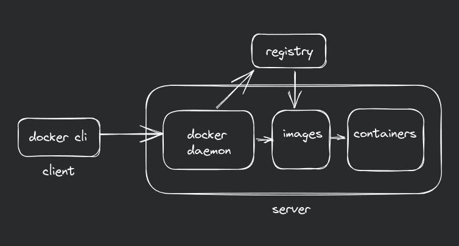
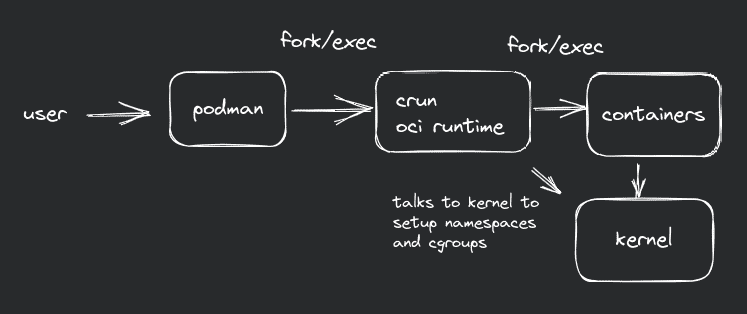

# Podman over Docker

Containers have changed the software development and deployment landscape. The Docker we know is a platform with various features such as Docker Registry, Docker Compose, Docker Swarm. Running container from OCI images using docker engine is just a part of Docker. 

Podman, originally developed by RedHat engineers, has emerged as a drop-in replacement for Docker. I got to know about Podman from Fedora, since they ship it by default in their Linux distribution.

### So, what makes podman better than docker? 
**Daemonless Architecture:**

A daemon is a process that runs in background which performs action without direct user interaction. Docker uses a client server model. The docker daemon, or `dockerd` is responsible to do all the heavy lifting of managing docker containers. It listens to API requests for instructions, while `docker` CLI tool acts as a frontend, which the user uses to interact with Docker. 

But this model introduces a single point of failure. In a way, well being of every running container depends on well being the docker daemon. Also, running docker daemon with root-level privileges poses security vulnerabilities. Root-level privileges i.e. the superuser in system, ideal for malicious actors target it. For example, using the root privileges to run malicious container can modify/delete vital system files.

Podman utilizes a daemonless model based on a fork-exec mechanism, eliminating the need for a central daemon and enabling enhanced security. By going rootless, users can create, run, and manage containers without requiring processes with admin privileges. Also, separate images for each user are stored in their own `$HOME` directory, rather being centralized like in Docker. Podman creates rootless containers by default. 

**The Fork/Exec model:**

fork() and exec() are system calls in Unix-like operating systems. fork() creates a new process by duplicating the existing process, though forking would be better fit for it, since the new process created by fork() are called child processes of the parent process. exec() replaces the current process image with a new process image.

By combining the fork and exec system calls, a new process can be created as an exact copy of the existing process, and then the new process can execute a different program.

In Podman, the runtime creates a new container process by forking the existing Podman daemon process. Then it sets up namespaces and cgroups (control groups) for the container, which deal with isolation (network, mount, userid, pid, etc.) and resource limitation for container respectively. After the namespaces and cgroups are set up, Podman executes the desired container image inside the newly created process using the exec system call. The exec system call replaces the current process with a new program, loading the container's root filesystem, starting the container's init process, and running the specified command within the container.

By this model, Podman doesn't need to keep running if there are no running containers, which isn't the case with docker.

**Podman systemd integration**

As Podman relies on using as much native Linux technologies under the hood, it is well integrated with systemd. You can setup a systemd unit file on your host computer, you can have the host automatically start, stop, check the status, and otherwise manage a container as a systemd service. You can also start services within a container using host's systemd!

Also, podman supports containers which can run their own init system inside the container, like the image: `docker.io/almalinux/8-init`. 

### Differences you'll experience when you move from Docker to Podman:
**No docker compose.**

There's a project [podman-compose](https://github.com/containers/podman-compose) which uses podman and libpod library to simulate a docker-compose like enviroment while keeping all the goodness of podman. 

**Pod based architecture**

Both Podman and Kubernetes use the concept of pods. In Kubernetes, a pod is the smallest deployable unit that consists of one or more containers sharing the same network namespace and storage volumes. Podman adopts a similar concept, allowing users to create and manage pods containing multiple containers that share resources and network connectivity. You can `podman generate kube <name>` to generate a kubernetes compatible config file or `podman play kube <config.yml>` to play that config on your dev enviroment.

**Podman is blazingly fast!**

Being daemonless lets podman to eliminate a step in container creation and management. Fork/Exec model allows podman to take much more linux-native approach in container creation. They also use they own container runtime called crun, rather than runc. crun is a small OCI runtime which is much minimal (about 50 times smaller than runc) with low memory footprint. You can read more about how they made podman faster in [this](https://www.redhat.com/sysadmin/speed-containers-podman-raspberry-pi) article. 

You can visit podman [docs](https://docs.podman.io/en/latest/) to learn more about podman.